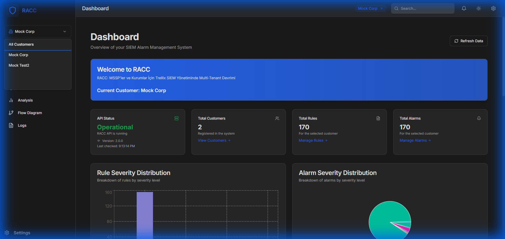
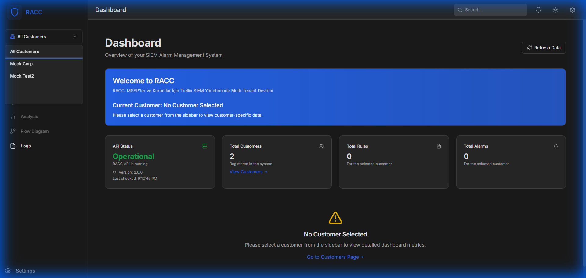
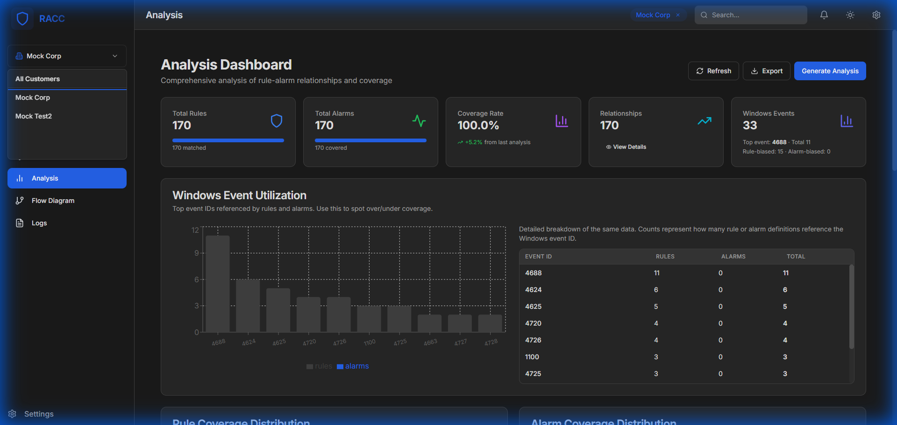

# RACC: Trellix SIEM Rule & Alarm Control Center

[Türkçe Versiyonu İçin Aşağı Kaydırın](#racc-trellix-siem-kural-ve-alarm-yönetim-merkezi-tr)

---

## 🇺🇸 English Version

RACC (Rule & Alarm Control Center) is a modern web interface developed for Trellix SIEM (formerly McAfee ESM) administrators and MSSP analysts to streamline rule and alarm management.

This project allows you to create, validate, and manage correlation rules and alarms through a visual interface without dealing with complex XML edits.



### 🚀 Key Features

#### 1. Visual Rule Analysis and Flow Diagrams
Trellix rules have complex logical structures. RACC converts these rules into understandable flow diagrams:
- Visualizes complex rule logic (AND, OR, NOT relationships).
- Clearly shows relationships between rules and alarms.
- Enables analysts to quickly understand existing rules and debug them.


#### 2. Multi-Customer Management
Designed for MSSPs:
- Manage rules and alarms for multiple customers from a single interface.
- Provides logical separation between customers.
- Offers customer-based statistics and reports.



#### 3. Bulk Operations and Efficiency
- **Bulk Import/Export:** Import/export rules and alarms in bulk.
- **Advanced Search:** Instant search and filtering among thousands of rules.
- **Cloning:** Copy an existing rule or alarm with a single click and adapt it for another customer.

#### 4. Analysis and Reporting
- Flow diagrams visualizing rule and alarm relationships.
- **Flexible Reporting:** Export rules and alarms in HTML or PDF format.
  - Interactive Mermaid diagrams in HTML reports.
  - Printable text-based logic schemes in PDF reports.
- Customer-based rule/alarm distribution charts.
- System logs and audit records.



### 🛠 Technical Infrastructure

RACC is built on modern, secure, and high-performance technologies:

- **Backend:** Python Flask (REST API)
- **Frontend:** React + Vite + Tailwind CSS (Modern UI)
- **Database:** SQLite (Default) / PostgreSQL (Optional)
- **Security:**
  - CSRF Protection
  - Secure Headers (Helmet)
  - Input Validation
  - Rate Limiting

### 📦 Installation and Deployment

#### Option 1: Quick Setup with Docker (Recommended)

You can stand up the entire system (Backend, Frontend, and Database) with a single command.

1. **Requirements:** Docker and Docker Compose must be installed.

2. **Security Setting (IMPORTANT):**
   Generate a strong `SECRET_KEY` for application security:
   
   ```bash
   # Generate a strong key
   python3 -c "import secrets; print(secrets.token_hex(32))"
   ```
   
   Save this key in the `.env` file or define it as an environment variable:
   ```bash
   export SECRET_KEY=<your-generated-key>
   ```

3. **Run:**
   ```bash
   # Clean install without cache
   docker-compose build --no-cache --pull
   
   # Start services
   docker-compose up -d
   
   # Follow logs
   docker-compose logs -f backend
   ```

4. **Access:**
   - **Interface:** `http://localhost:3000`
   - **API:** `http://localhost:5000`

#### Option 2: Manual Setup

**Backend**
```bash
cd backend
python -m venv venv
source venv/bin/activate  # Windows: venv\Scripts\activate
pip install -r requirements.txt

# Start in production mode
export FLASK_CONFIG=production  # Windows: $env:FLASK_CONFIG="production"
python production_server.py
```

**Frontend**
```bash
cd frontend
npm install
npm run build
# Serve files in 'dist' folder with a web server (Nginx etc.).
```

### ⚙️ Configuration (Environment Variables)

You can use the following environment variables to change application settings:

| Variable | Description | Default |
|----------|-------------|---------|
| `SECRET_KEY` | **Required.** Secret key for session security. | (None - Must be set) |
| `FLASK_CONFIG` | Operation mode (`development`, `production`). | `development` |
| `DATABASE_URL` | Database connection address. | `sqlite:///backend/database/app.db` |
| `ALLOWED_ORIGINS` | Allowed domains for CORS. | `http://localhost:3000` |
| `LOG_LEVEL` | Log detail level (`DEBUG`, `INFO`, `WARNING`). | `DEBUG` |

### 📂 Project Structure

```
Trellix-RACC/
├── backend/                # Python Flask API
│   ├── models/            # Database models
│   ├── routes/            # API endpoints
│   ├── utils/             # Utilities (XML parser, Auth etc.)
│   └── config.py          # Configuration file
├── frontend/               # React UI
│   ├── src/
│   │   ├── components/    # UI components and pages
│   │   └── context/       # State management
│   └── vite.config.js     # Build settings
└── docker-compose.yml      # Docker configuration
```

---

<a name="racc-trellix-siem-kural-ve-alarm-yönetim-merkezi-tr"></a>
## 🇹🇷 Türkçe Versiyon (RACC: Trellix SIEM Kural ve Alarm Yönetim Merkezi)

RACC (Rule & Alarm Control Center), Trellix SIEM (eski adıyla McAfee ESM) yöneticileri ve MSSP analistleri için geliştirilmiş, kural ve alarm yönetimini kolaylaştıran modern bir web arayüzüdür.

Bu proje, karmaşık XML düzenlemeleriyle uğraşmadan, görsel bir arayüz üzerinden korelasyon kuralları ve alarmlar oluşturmanızı, doğrulamanızı ve yönetmenizi sağlar.


### 🚀 Temel Özellikler

#### 1. Görsel Kural Analizi ve Akış Diyagramları
Trellix kuralları karmaşık mantıksal yapılara sahiptir. RACC, bu kuralları anlaşılır akış diyagramlarına dönüştürerek:
- Karmaşık kural mantığını (AND, OR, NOT ilişkileri) görselleştirir.
- Kural ve alarm arasındaki ilişkileri net bir şekilde gösterir.
- Analistlerin mevcut kuralları hızlıca anlamasını ve hata ayıklamasını sağlar.


#### 2. Çoklu Müşteri Yönetimi (Multi-Customer)
MSSP'ler için tasarlanmış yapı sayesinde:
- Birden fazla müşterinin kural ve alarmlarını tek bir arayüzden yönetebilirsiniz.
- Müşteriler arasında mantıksal ayrım (Logical Separation) sağlar.
- Müşteri bazlı istatistikler ve raporlar sunar.


#### 3. Toplu İşlemler ve Verimlilik
- **Bulk Import/Export:** Kuralları ve alarmları toplu olarak içe/dışa aktarın.
- **Gelişmiş Arama:** Binlerce kural arasında anında arama ve filtreleme.
- **Klonlama:** Mevcut bir kuralı veya alarmı tek tıkla kopyalayıp başka bir müşteri için uyarlayın.

#### 4. Analiz ve Raporlama
- Kural ve alarm ilişkilerini görselleştiren akış diyagramları.
- **Esnek Raporlama:** Kuralları ve alarmları HTML veya PDF formatında dışa aktarın.
  - HTML raporlarında interaktif Mermaid diyagramları.
  - PDF raporlarında yazdırılabilir metin tabanlı mantık şemaları.
- Müşteri bazlı kural/alarm dağılım grafikleri.
- Sistem logları ve audit kayıtları.


### 🛠 Teknik Altyapı

RACC, modern, güvenli ve performanslı teknolojiler üzerine inşa edilmiştir:

- **Backend:** Python Flask (REST API)
- **Frontend:** React + Vite + Tailwind CSS (Modern UI)
- **Veritabanı:** SQLite (Varsayılan) / PostgreSQL (Opsiyonel)
- **Güvenlik:** 
  - CSRF Koruması
  - Secure Headers (Helmet)
  - Input Validation
  - Rate Limiting

### 📦 Kurulum ve Dağıtım

#### Seçenek 1: Docker ile Hızlı Kurulum (Önerilen)

Tüm sistemi (Backend, Frontend ve Veritabanı) tek komutla ayağa kaldırabilirsiniz.

1. **Gereksinimler:** Docker ve Docker Compose yüklü olmalıdır.

2. **Güvenlik Ayarı (ÖNEMLİ):**
   Uygulama güvenliği için güçlü bir `SECRET_KEY` oluşturun:
   
   ```bash
   # Güçlü bir anahtar üretin
   python3 -c "import secrets; print(secrets.token_hex(32))"
   ```
   
   Bu anahtarı `.env` dosyasına kaydedin veya environment variable olarak tanımlayın:
   ```bash
   export SECRET_KEY=<urettiginiz-anahtar>
   ```

3. **Çalıştırma:**
   ```bash
   # Cache kullanmadan temiz kurulum
   docker-compose build --no-cache --pull
   
   # Servisleri başlatın
   docker-compose up -d
   
   # Logları izleyin
   docker-compose logs -f backend
   ```

4. **Erişim:**
   - **Arayüz:** `http://localhost:3000`
   - **API:** `http://localhost:5000`

#### Seçenek 2: Manuel Kurulum

**Backend**
```bash
cd backend
python -m venv venv
source venv/bin/activate  # Windows: venv\Scripts\activate
pip install -r requirements.txt

# Production modunda başlatma
export FLASK_CONFIG=production  # Windows: $env:FLASK_CONFIG="production"
python production_server.py
```

**Frontend**
```bash
cd frontend
npm install
npm run build
# 'dist' klasöründeki dosyaları bir web sunucusu (Nginx vb.) ile sunun.
```

### ⚙️ Konfigürasyon (Environment Variables)

Uygulama ayarlarını değiştirmek için aşağıdaki ortam değişkenlerini kullanabilirsiniz:

| Değişken | Açıklama | Varsayılan |
|----------|----------|------------|
| `SECRET_KEY` | **Zorunlu.** Session güvenliği için gizli anahtar. | (Yok - Ayarlanmalı) |
| `FLASK_CONFIG` | Çalışma modu (`development`, `production`). | `development` |
| `DATABASE_URL` | Veritabanı bağlantı adresi. | `sqlite:///backend/database/app.db` |
| `ALLOWED_ORIGINS` | CORS için izin verilen domainler. | `http://localhost:3000` |
| `LOG_LEVEL` | Log detay seviyesi (`DEBUG`, `INFO`, `WARNING`). | `DEBUG` |

### 📂 Proje Yapısı

```
Trellix-RACC/
├── backend/                # Python Flask API
│   ├── models/            # Veritabanı modelleri
│   ├── routes/            # API endpoint'leri
│   ├── utils/             # Yardımcı araçlar (XML parser, Auth vb.)
│   └── config.py          # Konfigürasyon dosyası
├── frontend/               # React UI
│   ├── src/
│   │   ├── components/    # UI bileşenleri ve sayfalar
│   │   └── context/       # State yönetimi
│   └── vite.config.js     # Build ayarları
└── docker-compose.yml      # Docker konfigürasyonu
```

---
*Developer Note: This project is designed to centralize security operations and reduce the risk of manual errors.*
*Geliştirici Notu: Bu proje, güvenlik operasyonlarını merkezileştirmek ve manuel hata riskini azaltmak amacıyla tasarlanmıştır.*
